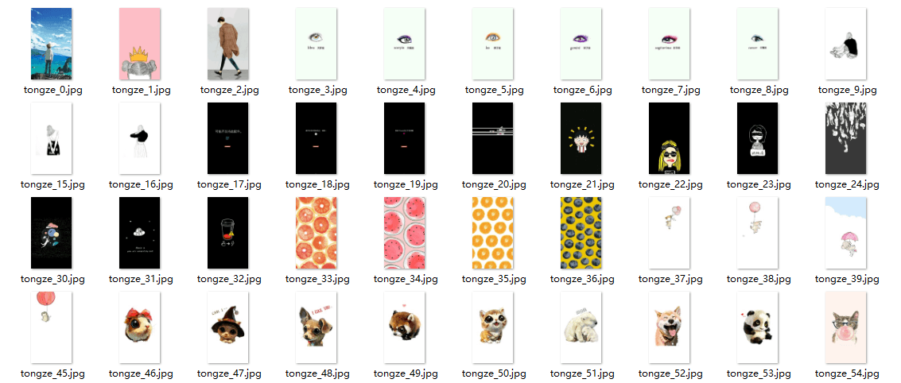

> createTime: 2019/10/08

## 百度贴吧手机壁纸爬虫
> 爬取百度贴吧的手机壁纸图片...



#### center Code
```python
# example...
import re
import urllib

# fragment
urllib.urlopen(href)
re.findall(regex, code)
urllib.urlretrieve(img, "./Downloads/" + ImageName + "_%s.jpg" % count)
```
